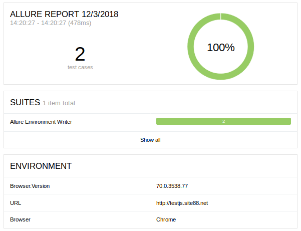

# allure-environment-writer

Java library which allows to write environment.xml file into allure-results directory.
Currently, the library supports Allure report with either JUnit or TestNG. It would allow you:

* Easily write the environment.xml file to allure-results directory in any stage of your test.
* Flexible path of 'allure-results' directory.
* Use ImmutableMap to create immutable set of values for the environment to contain.

### Example of common usage (default path is target/allure-results):

```
import static com.github.automatedowl.tools.AllureEnvironmentWriter.allureEnvironmentWriter;

public class SomeTests {

    @BeforeSuite
    void setAllureEnvironment() {
        allureEnvironmentWriter(
                ImmutableMap.<String, String>builder()
                        .put("Browser", "Chrome")
                        .put("Browser.Version", "70.0.3538.77")
                        .put("URL", "http://testjs.site88.net")
                        .build());
    }

    @Test
    void sanityOneTest() {
        Assert.assertTrue(true);
    }

    @Test
    void sanityTwoTest() {
        Assert.assertTrue(true);
    }
}
```

### Example of usage with customized allure-results path:

```
import static com.github.automatedowl.tools.AllureEnvironmentWriter.allureEnvironmentWriter;

public class SomeTests {

    @BeforeSuite
    void setAllureEnvironment() {
        allureEnvironmentWriter(
                ImmutableMap.<String, String>builder()
                        .put("Browser", "Chrome")
                        .put("Browser.Version", "70.0.3538.77")
                        .put("URL", "http://testjs.site88.net")
                        .build(), System.getProperty("user.dir")
                        + "/allure-results/");
    }

    @Test
    void someTest() {
        Assert.assertTrue(true);
    }
}
```

### Sanpshot of received environment data in Allure report:



### Maven dependencies

```
    <dependency>
        <groupId>com.github.automatedowl</groupId>
        <artifactId>allure-environment-writer</artifactId>
        <version>1.0.0</version>
    </dependency>
```
